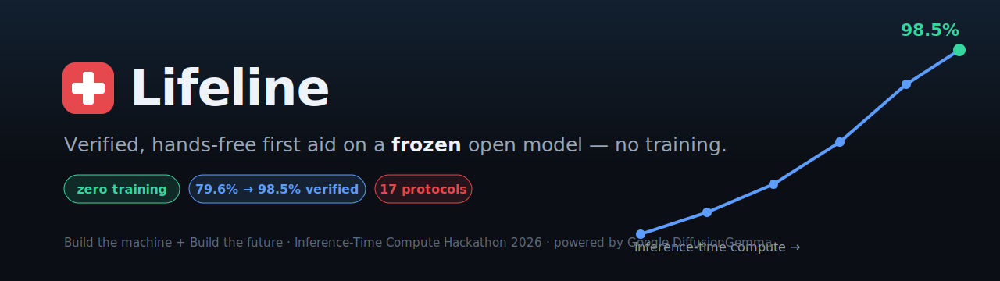
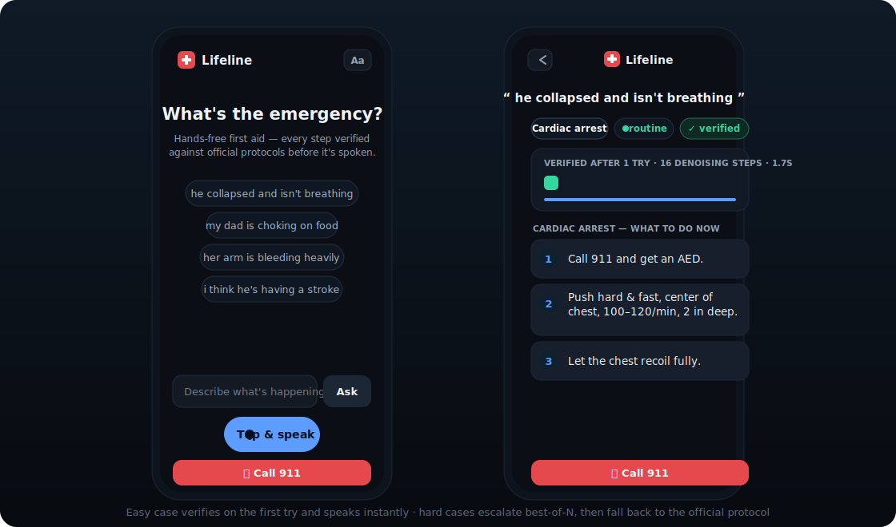

<div align="center">



<h1>✚ Lifeline</h1>

<p><b>Turn a <i>frozen</i> open-source model into a ~98%-verified first-aid assistant — with inference-time compute and a deterministic verifier. <i>Zero training.</i></b></p>

<p><i>Build as if compute is free, then verify.</i></p>

<p>
  <a href="https://vnmoorthy.github.io/lifeline/"></a>
  <a href="https://vnmoorthy.github.io/lifeline/dashboard.html"></a>
  <a href="Lifeline_Deck.pptx"></a>
</p>

<p>
  <a href="https://github.com/vnmoorthy/lifeline/actions/workflows/ci.yml"></a>
  
  
  
  
  
</p>

<br>

<a href="https://vnmoorthy.github.io/lifeline/"></a>

</div>

> In a real emergency you can't read a web page — your hands are busy and seconds matter — and a wrong instruction can kill. **Lifeline** is a voice-first first-aid assistant you *talk to*, and every step is checked against the official protocol **before you hear it**.

---

## ⚡ Try it in 10 seconds

| | |
|---|---|
| 🔴 **Live voice app** | **https://vnmoorthy.github.io/lifeline/** — tap a chip or the mic, it speaks verified steps (runs entirely in your browser) |
| 📊 **Results dashboard** | **https://vnmoorthy.github.io/lifeline/dashboard.html** — the real accuracy-vs-compute curves + the verifier-vs-judge result |
| 💻 **Run locally** | `python3 -m lifeline.mock_ui` → open `http://localhost:8090` (no GPU needed) |

---

## 🧠 The idea

The reflex when an open model isn't reliable enough is to **fine-tune** it. We did the opposite. We leave Google's **DiffusionGemma-26B completely frozen — zero gradient steps** — and spend compute at *inference time* instead, then gate every answer through a **deterministic verifier** that keeps only protocol-correct steps.

The model stays dumb; the **system** becomes safe. That's the "Build the machine" bet — near-infinite compute, near-zero latency — applied to a task where being wrong is unacceptable.

```
 speech ─▶ recognize emergency ─▶ generate N candidates (best-of-N × denoising depth)
                                          │
                                          ▼
                          deterministic verifier  ✅ required steps present
                                                   ⛔ forbidden actions absent
                                          │
                  ┌───────────────────────┴───────────────────────┐
            first verified answer                     none verified → official protocol
                  └───────────────────────┬───────────────────────┘
                                          ▼
                              spoken aloud — never an unverified step
```

## 📈 The numbers (real, measured on a frozen model)

Two inference-time knobs, no weights touched:

| Knob | Result |
|------|--------|
| **Denoising depth** (2 → 32 steps) | accuracy 7.5% → **67.5%** (knee at 16 steps) |
| **Best-of-N** (1 → 16 @ 16 steps) | single-shot 79.6% → **98.45% verified** |
| **Cross-check** (Qwen2.5-7B, frozen) | 65% → **98.3%** — it's the *method*, not the model |
| **Training** | **none** · **Latency** 0.5–1.9 s |

## 🛡️ Why a deterministic verifier beats an LLM-judge

Best-of-N is adversarial search — with enough samples you *will* surface fluent, confident, **wrong** answers. The selector has to be a rule, not a vibe. On a **42-candidate adversarial test set**:

> **The deterministic verifier caught 12/12 fluent-but-dangerous answers with 0 unsafe leaks.**

| | Deterministic verifier | LLM-as-judge |
|---|---|---|
| Consistency | same input → same verdict | flip-flops run-to-run |
| Reward-hacking | immune (checks rules, not fluency) | fooled by confident prose |
| Cost / candidate | ~0 (so best-of-N scales) | one API call each |
| Safety | hard guarantee | probabilistic |

Run it yourself: `python3 -m lifeline.judge_experiment` (add `ANTHROPIC_API_KEY` for the live LLM-judge head-to-head).

## 🩺 Coverage

17 protocols, each grounded in Red Cross / AHA / NHS guidance: cardiac arrest, choking, severe bleeding, opioid overdose, burns, anaphylaxis, stroke, seizure, heart attack, drowning, low blood sugar, heat stroke, hypothermia, poisoning, head injury, nosebleed, fracture. **Safety invariant:** every canonical fallback passes the verifier, so the system can always emit a verified-or-canonical answer — never an unverified one.

## 🚀 Quickstart

```bash
./check.sh                      # syntax + 60+ tests (recognition, safety invariant, verifier) — no GPU
python3 -m lifeline.mock_ui     # the app, GPU-free → http://localhost:8090
python3 -m lifeline.judge_experiment   # verifier vs LLM-judge on the adversarial set
```

The real model (1× A100-80GB): `bash scripts/setup_diffusion_gpu.sh` → `scp -r lifeline <box>:~/` → `python3 -m lifeline.diffusion_server`.

## 🗂️ Layout

| Path | Role |
|------|------|
| `lifeline/triage.py` | recognition (negation-aware priority ladder) · canonical protocols |
| `lifeline/real_run.py` | the deterministic verifier · protocol concept-groups |
| `lifeline/ui_page.py` | the mobile-first accessible voice UI (single source of truth) |
| `lifeline/diffusion_server.py` | the live product on DiffusionGemma (GPU) |
| `lifeline/judge_experiment.py` | verifier vs LLM-judge harness |
| `docs/` | the live GitHub Pages site (app + dashboard) |
| `tests/`, `check.sh` | the GPU-free test gate |
| `DEVPOST.md`, `DEMO.md`, `Lifeline_Deck.pptx` | submission writeup, demo script, slides |

## ⚠️ Disclaimer

Lifeline is decision support, **not a medical device** and not a substitute for professional care. **Always call 911.**

<div align="center"><sub>Inference-Time Compute Hackathon 2026 · Build the machine + Build the future</sub></div>
